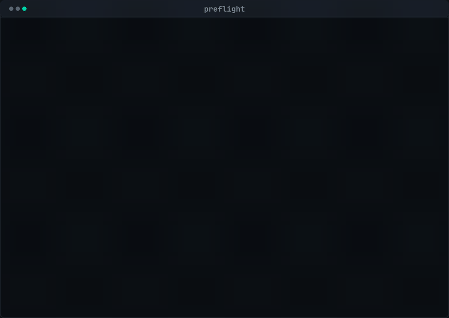

<div align="center">
  
  <h1>preflight</h1>
  <p><strong>Prices an agent workflow before it runs.</strong><br>
  <sub>Dependabot, but for agent spend — it comments the predicted agent count and dollar cost on the PR that changed the spec.</sub></p>
  <p><a href="https://unchained-labs.github.io/preflight/">Docs</a> · <a href="#the-model">The model</a> · <a href="#action">Action</a></p>
</div>

<div align="center">
  
  <br><sub>Agents, dollars, and which stage dominates — before the run. <a href="https://unchained-labs.github.io/preflight/">Full docs →</a></sub>
</div>

---

**Status: alpha.** The model is honest about its assumptions but the assumptions
are defaults, not measurements from your workload. Calibrate them before trusting
a number in a budget conversation.

```
$ preflight estimate audit.graph.json

  route-auth-audit  estimated before running

  agents       114  (66–222)
  cost       $0.974  ($0.687–$1.62)
  tokens      588k in  70k out
  budget     $12.00  ✓ under

  where it goes

  verify     █████████████░░░░░░░░░░░░░░░   $0.435  45%
  fan-out    █████████░░░░░░░░░░░░░░░░░░░   $0.299  31%
  synthesis  ██████░░░░░░░░░░░░░░░░░░░░░░   $0.210  22%
  scope      █░░░░░░░░░░░░░░░░░░░░░░░░░░░   $0.029  3%

  ! verification is 45% of this run. findings × lenses, not fan-out width, is usually the growth term.

  biggest levers

     $0.435  verify (verifier)
             drop a lens, or replace one with an executable oracle
     $0.299  inspect (worker)
             narrow the fan-out, or add a zero-token prefilter
```

## Why

Runtime cost guards already exist: they stop a run that has already started
spending. Nothing tells you what a workflow will cost **before you merge the
change that made it expensive** — which is when it is cheap to fix.

Adding a third verifier lens is a one-line diff. It can be a 50% cost increase,
and nothing in the review surfaces that. This does.

## The model

```
cost ≈ Σ_nodes    (fanout × tier_rate)
     + Σ_findings  (findings × lenses × verify_rate)   ← the term that bites
     + retries     × schema_mismatch_rate
     + rounds      (if the graph has a cycle)
```

Two commitments, because a cost estimator lives or dies on whether people
believe it:

**1. Every assumption is named, printed, and overridable.** The output states the
token profile it used per node kind, the findings-per-unit ratio, the retry rate
and the cache assumption. A number with hidden assumptions is a number nobody can
argue with, which means nobody can trust it.

**2. It reports a range.** Fan-out width, finding counts and round counts are
usually unknown until the run happens. Emitting `$12.40` implies a precision the
input does not contain, so you get low/expected/high, and every node whose count
was assumed rather than read is marked `~`.

### Prompt caching is modelled

A fan-out shares a prompt prefix, so the first call writes the cache at 1.25×
and the rest read it at 0.1×. Ignoring that overstates a wide fan-out
substantially, so it is in the model with the multipliers exposed.

### Prices are a cache, and say so

The pricing table carries the date it was verified, `preflight estimate` prints
that date, and CI fails when the table is older than 120 days. A cost tool
quoting stale prices is worse than one that admits it does not know.

Introductory rates are handled explicitly: Sonnet 5's intro pricing expires
2026-08-31, so `--as-of 2026-09-01` prices it at the standard $3/$15 rather than
the promotional $2/$10. Quoting the intro rate for a workflow that will run in
September is exactly the kind of helpful rounding that makes a tool untrustworthy.

## Install

```sh
npm i -g preflight-cost      # or npx preflight-cost
```

## Usage

```sh
preflight estimate <spec>              # agents, cost, biggest levers
preflight diff <spec> --base origin/main
preflight models                       # the table and when it was verified
preflight calibrate <usage.json>       # replace a guessed profile with a measured one
```

| Flag | Effect |
| :--- | :--- |
| `--format text\|json\|markdown` | `markdown` is the PR comment body. |
| `--max-usd N` | Exit 1 if expected cost exceeds N. |
| `--as-of YYYY-MM-DD` | Price as of a date — intro rates expire. |
| `"cacheTtl": "5m"\|"1h"` | In `preflight.json`. Decides what a cache write costs. |
| `--config <file>` | Assumption overrides (default `preflight.json`). |
| `--kind scope\|worker\|verifier\|synthesis` | Which profile `calibrate` writes (default `worker`). |
| `--out <file>` | Where `calibrate` writes. Default is stdout. |
| `--min-samples N` | Refuse to calibrate below this many records (default 5). |

### Two input shapes, honestly different accuracy

| Input | Accuracy |
| :--- | :--- |
| **Declarative spec** (`*.graph.json`) | Tight. Width, tier and lens count are data, so the estimate is arithmetic on numbers you wrote down. |
| **Script** (`agent()`, `parallel()`) | Wide. Those numbers are runtime values. We recover what is statically visible and mark the rest assumed. |

This is a property of the input, not something to engineer away. If you want a
tight number, write the spec.

### Calibrating

```json
{
  "profiles": {
    "worker":   { "input": 12000, "output": 600, "cacheHitRate": 0.8 },
    "verifier": { "input": 2500,  "output": 300, "cacheHitRate": 0.9 }
  },
  "findingsPerWorker": { "low": 0.1, "expected": 0.4, "high": 1.0 },
  "schemaRetryRate": 0.02,
  "cacheTtl": "1h"
}
```

#### Cache writes are billed by how long they live

`cacheTtl` decides what writing the shared prefix costs: **1.25× the input rate
for the API's five-minute default, 2× for the one-hour tier.** On a workload that
is mostly cached the difference is about a third of the bill, so this is not a
detail to leave at whatever the default happens to be.

preflight shipped a single 1.25× multiplier until
[localflow](https://github.com/Unchained-Labs/localflow) checked it against an
oracle — `claude -p --output-format json` reports `total_cost_usd` for the run it
just did:

```
  531 input + 22188 cache-read + 3026 cache-write(1h) + 51 output, haiku
  1.25x -> $0.0067873000
  2.00x -> $0.0090568000
  CLI   -> $0.0090568000
```

Claude Code writes one-hour entries, so `"cacheTtl": "1h"` is the right setting
for a graph running on it. The default stays `"5m"` because that is the API
default. A `preflight.json` that still sets the old `cacheWriteMultiplier` is
honoured as-is rather than silently repriced.

Run one real workflow, read the actual token counts out of your spans, and put
them here. The defaults are a starting point, not a measurement of your workload.

#### Or let it read the spans for you

Most orchestrators already record per-call token usage. `calibrate` takes those
rows and writes the profile, so the step above stops being manual arithmetic. It
reads a JSON array, a single object, or JSONL — which covers whichever of those
your shell loop produced:

```sh
# Otter records this per job at GET /v1/jobs/{id}/usage
for id in $(cat job-ids); do curl -s "$OTTER/v1/jobs/$id/usage"; done \
  | jq -s . | preflight calibrate - --kind worker --out preflight.json
```

```
  calibrating the worker profile from 23 measured call(s)

             assumed   measured   change   p10–p90
  input         8000 →    16024    ×2.00   9845–35458
  output         800 →      567    ×0.71   382–969

  cacheHitRate  0.7 (unchanged)
                not measurable from usage rows — nothing in them reports cache reads
```

Three things it refuses to do, because a number that *looks* measured and is not
is worse than an assumption that admits it:

- **It does not invent a cache hit rate.** Usage rows do not report cache reads,
  so there is nothing to derive one from. The existing value is carried through
  and the report says so. This is the most tempting number to fabricate — it
  moves the cost materially and nobody would check.
  **Where the rows do report it, measure it:**
  [localflow](https://github.com/Unchained-Labs/localflow) reads Claude Code
  transcripts, which carry `cache_read_input_tokens`, and writes the measured
  rate into a `preflight.json` this reads — `localflow calibrate > preflight.json`.
- **It does not guess which node kind a job was.** A single-prompt job has no
  `worker`/`verifier` distinction to read. You name the kind; the default is
  `worker`, because a prompt in and a result out *is* the worker shape.
- **It refuses below five samples.** Two runs produce a number with the authority
  of a measurement and the accuracy of a guess. It exits 1 and writes nothing
  rather than half-calibrating.

It writes the **median**, not the mean: token distributions are right-skewed, and
one run that filled a 400k context should not set your profile. The p10–p90 spread
is reported separately, because the tail is what blows a budget. The write merges
into an existing `preflight.json` rather than replacing it, and records a
`$calibration` block with the sample size and date — a calibrated config with no
date will be trusted long after it stopped being true.

## Action

```yaml
name: preflight
on: pull_request

permissions:
  contents: read
  pull-requests: write

jobs:
  cost:
    runs-on: ubuntu-latest
    steps:
      - uses: actions/checkout@v4
        with: { fetch-depth: 0 }   # needed to diff against the base
      - uses: Unchained-Labs/preflight@v0
        with:
          paths: |
            .claude/workflows/**
            **/*.graph.json
          max-usd: "25"
```

It posts one comment and **updates it in place** on later pushes rather than
adding a new one each time. Outputs `usd` and `agents` for downstream steps.

The action is deliberately dependency-free — no `@actions/core`, no
`@actions/github`. A cost bot that needs a 40MB install to post one comment is a
cost bot nobody adopts.

## What it does not do

- **It is an estimate, not a quote.** It cannot know how many findings your scan
  will produce or how wide a runtime fan-out gets.
- **It does not check whether your graph is correct.** That is
  [graphlint](https://github.com/Unchained-Labs/graphlint).
- **It does not track actual spend.** It prices the spec, not the run. Compare
  its output against your real spans and feed the difference back with
  `preflight calibrate`.
- **Defaults are generic until you calibrate.** Uncalibrated, treat the shape
  (which stage dominates) as more reliable than the absolute figure.
- **Calibration cannot recover a cache hit rate from *usage rows*** — they do not
  carry one. It can be measured from a source that does:
  [localflow](https://github.com/Unchained-Labs/localflow) reads it out of Claude
  Code transcripts. Where neither is available it stays a declared guess, and it
  is the assumption the total is most sensitive to.

## Development

```sh
pnpm install && pnpm build && pnpm test   # 82 tests
node dist/cli.js estimate test/fixtures/audit.graph.json
node dist/cli.js estimate test/fixtures/expensive.graph.json   # same graph, all deep
```

## Licence

MIT. Part of [Unchained Labs](https://unchained-labs.github.io/) — see also
[graphlint](https://github.com/Unchained-Labs/graphlint) (lint the spec) and
[decorrelate](https://github.com/Unchained-Labs/decorrelate) (measure verifier
independence).
